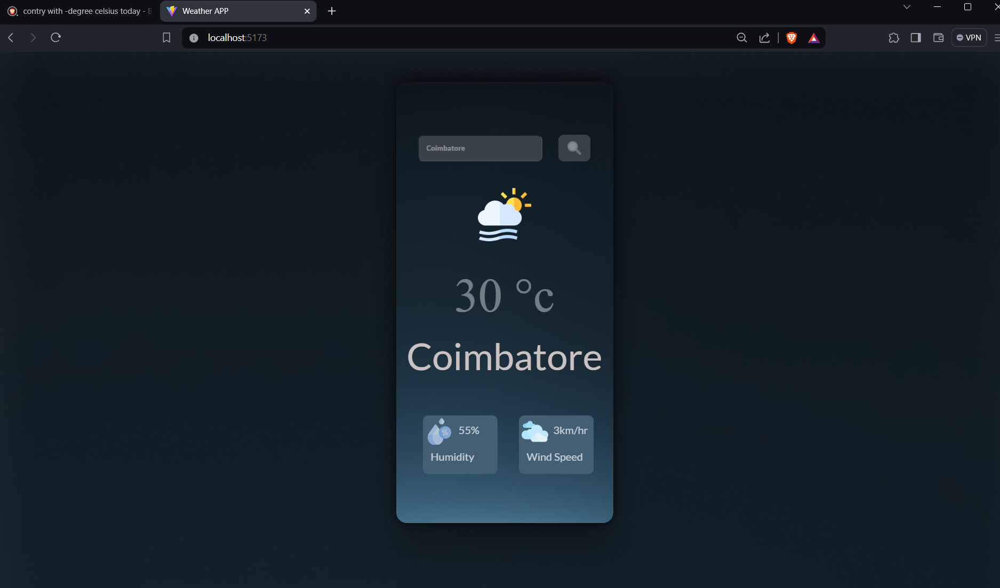

# Weather App

## Description

This is a simple weather application built with Vite and React, designed to provide users with accurate and up-to-date weather information. Leveraging the OpenWeatherMaps API, this app fetches current weather data for any location around the globe.

## Features

- **Current Weather:** Display current weather conditions including temperature, humidity, wind speed, and weather description.
- **Location Search:** Users can search for weather information by entering the name of a city or location.
- **Responsive Design:** The app is optimized for various screen sizes, providing a seamless experience across devices.
- **User-Friendly Interface:** Clean and intuitive UI for easy navigation and understanding of weather data.

## Technologies Used

- **Vite:** A fast, opinionated web dev build tool that serves your code via native ES modules.
- **React:** A popular JavaScript library for building user interfaces.
- **OpenWeatherMaps API:** Provides weather data and forecasts for cities worldwide.

## Usage

1. Clone this repository to your local machine.
2. Install dependencies using `npm install` or `yarn install`.
3. Get an API key from [OpenWeatherMaps](https://openweathermap.org/) and replace `'YOUR_API_KEY'` in `src/api/config.js` with your API key.
4. Run the app locally using `npm run dev` or `yarn dev`.
5. Access the app in your browser at `http://localhost:3000`.

## Contribution

Contributions are welcome! If you find any issues or would like to add new features, feel free to open an issue or submit a pull request.

## License

This project is licensed under the MIT License - see the [LICENSE](LICENSE) file for details.

## Author

[Your Name] - [Your Website/Blog](https://yourwebsite.com)

## Acknowledgments

- Thanks to [OpenWeatherMaps](https://openweathermap.org/) for providing the weather data API.
- Built with inspiration from various React and Vite community resources.
